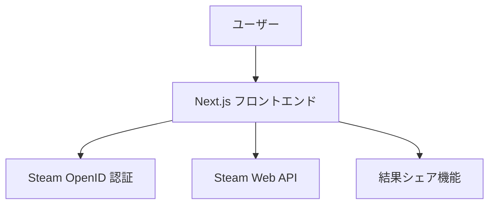

# 設計文書

## 概要

Steam相性診断は、Steam Web APIとOpenID認証を活用してユーザー間のゲーミング相性を分析するNext.jsアプリケーションです。Vercelでの静的サイトデプロイメントに最適化され、サーバーレス関数を通じてSteam認証とAPI呼び出しを処理します。

## アーキテクチャ

### 全体構成



### 技術スタック

- **フロントエンド**: Next.js 14 (App Router)
- **スタイリング**: Tailwind CSS
- **認証**: Steam OpenID 2.0 (フロントエンド実装)
- **API**: Steam Web API (直接呼び出し)
- **デプロイメント**: Vercel (静的サイト)
- **環境変数**: Steam Web API Key (ビルド時設定)
- **状態管理**: React Context (セッション中のみ)
- **HTTP クライアント**: fetch API

## コンポーネントとインターフェース

### 1. 認証システム

#### SteamAuthProvider
```typescript
interface SteamAuthContext {
  user: SteamUser | null;
  login: () => Promise<void>;
  logout: () => void;
  isLoading: boolean;
}

interface SteamUser {
  steamId: string;
  personaName: string;
  avatarUrl: string;
  profileUrl: string;
}
```

#### 認証フロー
1. ユーザーがログインボタンをクリック
2. Steam OpenID認証URLにリダイレクト
3. Steam認証ページでユーザーがログイン
4. 認証成功後、コールバックURLでレスポンスを受信
5. フロントエンドでOpenIDレスポンスを検証
6. Steam IDを抽出してセッション状態に保存

### 2. Steam API インテグレーション

#### SteamApiService
```typescript
interface GameLibrary {
  games: Game[];
  totalCount: number;
  isPublic: boolean;
}

interface Game {
  appId: number;
  name: string;
  playtimeForever: number;
  playtime2Weeks?: number;
  imgIconUrl?: string;
  genres?: string[];
}

class SteamApiService {
  async getOwnedGames(steamId: string, apiKey: string): Promise<GameLibrary>;
  async getPlayerSummary(steamId: string, apiKey: string): Promise<SteamUser>;
  async resolveVanityUrl(vanityUrl: string, apiKey: string): Promise<string>;
}
```

### 3. 相性分析エンジン

#### CompatibilityAnalyzer
```typescript
interface CompatibilityResult {
  score: number; // 0-100
  commonGames: CommonGame[];
  genreCompatibility: GenreCompatibility[];
  playtimeCompatibility: PlaytimeCompatibility;
  recommendations: GameRecommendation[];
  coopSuggestions: CoopGameSuggestion[];
}

interface CommonGame {
  appId: number;
  name: string;
  user1Playtime: number;
  user2Playtime: number;
  compatibilityFactor: number;
  isCoopSupported?: boolean;
}

interface CoopGameSuggestion {
  appId: number;
  name: string;
  coopType: 'local' | 'online' | 'both';
  maxPlayers: number;
  description: string;
  steamUrl: string;
}

class CompatibilityAnalyzer {
  analyze(library1: GameLibrary, library2: GameLibrary): CompatibilityResult;
  private calculateBaseScore(commonGames: CommonGame[]): number;
  private analyzeGenreCompatibility(library1: GameLibrary, library2: GameLibrary): GenreCompatibility[];
  private calculatePlaytimeCompatibility(commonGames: CommonGame[]): PlaytimeCompatibility;
  private suggestCoopGames(commonGames: CommonGame[]): CoopGameSuggestion[];
}
```

### 4. UI コンポーネント

#### 主要コンポーネント
- `LoginButton`: Steam認証ボタン
- `UserProfile`: ユーザープロフィール表示
- `LibraryDisplay`: ゲームライブラリ表示
- `CompatibilityForm`: 相性診断フォーム
- `ResultsDisplay`: 結果表示コンポーネント
- `CoopSuggestions`: co-opゲーム提案コンポーネント
- `ShareButton`: 結果シェア機能

## データモデル

### Steam API レスポンス構造

#### GetOwnedGames レスポンス
```typescript
interface GetOwnedGamesResponse {
  response: {
    game_count: number;
    games: Array<{
      appid: number;
      name?: string;
      playtime_forever: number;
      playtime_2weeks?: number;
      img_icon_url?: string;
    }>;
  };
}
```

#### GetPlayerSummaries レスポンス
```typescript
interface GetPlayerSummariesResponse {
  response: {
    players: Array<{
      steamid: string;
      personaname: string;
      avatar: string;
      avatarmedium: string;
      avatarfull: string;
      profileurl: string;
      communityvisibilitystate: number;
    }>;
  };
}
```

### 相性分析データ構造

#### 相性スコア計算式
```typescript
// 基本スコア = (共通ゲーム数 / 総ゲーム数の平均) * 100
// ジャンル相性 = 共通ジャンルの重み付けスコア
// プレイ時間相性 = 共通ゲームのプレイ時間類似度
// co-opボーナス = 共通co-opゲーム数による追加スコア
// 最終スコア = (基本スコア * 0.35) + (ジャンル相性 * 0.25) + (プレイ時間相性 * 0.25) + (co-opボーナス * 0.15)
```

#### co-opゲーム提案アルゴリズム
```typescript
// 1. 共通ゲームからco-op対応ゲームを抽出
// 2. Steam Store APIまたは静的データベースでco-op情報を取得
// 3. プレイ時間とジャンル嗜好に基づいて優先度を計算
// 4. ローカル/オンラインco-op、最大プレイヤー数で分類
// 5. 上位5-10個のco-opゲームを提案として返却
```

## 正確性プロパティ

*プロパティとは、システムのすべての有効な実行において真であるべき特性や動作のことです。プロパティは、人間が読める仕様と機械で検証可能な正確性保証の橋渡しとなります。*

### プロパティ1: Steam認証フロー
*すべての* ログインボタンクリックに対して、正しいSteam OpenIDリダイレクトURLが生成され、認証成功時にはSteam IDがセッションに安全に保存される
**検証対象: 要件 1.1, 1.4**

### プロパティ2: 認証エラーハンドリング
*すべての* 無効な認証レスポンスに対して、適切なエラーメッセージが表示され、再試行オプションが提供される
**検証対象: 要件 1.3**

### プロパティ3: プロフィール情報取得
*すべての* 有効な認証レスポンスに対して、対応するSteamプロフィール情報が正しく取得される
**検証対象: 要件 1.2**

### プロパティ4: ゲームライブラリ取得と表示
*すべての* 認証されたユーザーに対して、ゲームライブラリが取得され、正確なゲーム数が表示される
**検証対象: 要件 2.1, 2.2**

### プロパティ5: APIレート制限処理
*すべての* レート制限エラーに対して、指数バックオフによる適切な再試行メカニズムが実行される
**検証対象: 要件 2.4, 6.3**

### プロパティ6: 入力処理と検証
*すべての* Steam ID入力（URL形式含む）に対して、有効な入力は正しく処理され、無効な入力は適切なエラーメッセージと共に拒否される
**検証対象: 要件 3.1, 6.2**

### プロパティ7: 相性分析計算
*すべての* 2つのゲームライブラリペアに対して、共通ゲーム、ジャンル相性、プレイ時間相性に基づいて一貫した相性スコア（0-100）が計算される
**検証対象: 要件 3.2, 3.3**

### プロパティ8: 結果表示の完全性
*すべての* 相性分析結果に対して、共通ゲーム情報、プレイ時間、ジャンル内訳、co-opゲーム提案が含まれた完全な結果が表示される
**検証対象: 要件 3.4, 4.1, 4.2**

### プロパティ9: シェア機能
*すべての* 相性結果に対して、有効なシェア可能URLと視覚的サマリーカードが生成される
**検証対象: 要件 4.3, 4.4**

### プロパティ10: レスポンシブデザイン
*すべての* 画面サイズ（デスクトップ、タブレット、モバイル）に対して、UIコンポーネントが適切にレイアウト調整される
**検証対象: 要件 5.1**

### プロパティ11: セッション中キャッシュ
*すべての* API呼び出しに対して、セッション中のメモリキャッシュにより重複リクエストが回避され、ローディング状態が適切に表示される
**検証対象: 要件 5.2, 5.3**

### プロパティ13: co-opゲーム提案
*すべての* 共通ゲームライブラリに対して、co-op対応ゲームが適切に識別され、プレイヤー数とco-opタイプ情報と共に提案される
**検証対象: 要件 3.3, 4.1**

<function_calls>
<invoke name="prework">
<parameter name="featureName">steam-compatibility-checker

## エラーハンドリング

### 認証エラー
- **無効なOpenIDレスポンス**: エラーメッセージ表示と再試行オプション
- **セッション期限切れ**: 自動ログアウトと再認証プロンプト
- **Steam API認証失敗**: 明確なエラーメッセージとトラブルシューティングガイド

### API エラー
- **レート制限**: 指数バックオフによる自動再試行（最大3回）
- **ネットワークエラー**: 接続状態の確認とオフライン対応
- **Steam API障害**: メンテナンスメッセージと代替機能の提供

### データエラー
- **非公開プロフィール**: 設定変更の案内と代替手段の提示
- **無効なSteam ID**: 入力形式の説明と例の提供
- **空のゲームライブラリ**: 適切なメッセージと推奨アクション

### UI エラー
- **レスポンシブ対応**: 画面サイズに応じたエラー表示の最適化
- **アクセシビリティ**: スクリーンリーダー対応のエラーメッセージ
- **多言語対応**: 日本語と英語でのエラーメッセージ提供
### プロパティ14: 静的サイト機能
*すべての* ユーザーインタラクションに対して、静的サイトとして適切なクライアントサイドルーティングが実行される
**検証対象: 要件 7.1, 7.3**